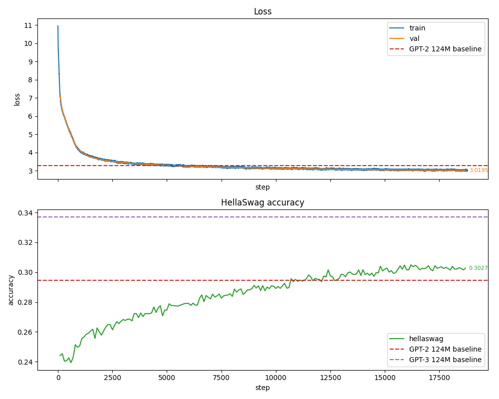

# Chatling

Playing around with Karpathy's [nanochat](https://github.com/karpathy/nanochat) and [build-nanogpt](https://github.com/karpathy/build-nanogpt), to reproduce a baby 124M parameter GPT2-style LLM.


## Results

Only ~$30 was spent on pretraining + SFT + RLVR combined, on a 4x A100 setup, so the model is still pretty dumb lol:

```
You: hello
Assistant: Hello! How can I help you today?

You: what is the capital of France?
Assistant: The Capital French is Paris.

You: what is 1 + 1?
Assistant: 1 + 1 = 1.
```

But even with pretraining on only 10B tokens, the model surpassed the original 124M parameter GPT2



## How to use

Chat with the model:

```
uv run python -m sft.inference --hf_model pbrut/chatling
```


## How to train

Download every dataset used across all stages ([FineWeb-edu](https://huggingface.co/datasets/HuggingFaceFW/fineweb-edu) + [HellaSwag](https://github.com/rowanz/hellaswag) for pre-training, [SmolTalk](https://huggingface.co/datasets/HuggingFaceTB/smol-smoltalk) + [GSM8K](https://huggingface.co/datasets/openai/gsm8k) for SFT, and the same [GSM8K](https://huggingface.co/datasets/openai/gsm8k) again for RLVR) up front. Run once, before any DDP training script:

```
./data/download_datasets.sh
```

### Pre-training

1. Train the model across `<num_gpus>` GPUs in parallel:

   ```
   uv run torchrun --standalone --nproc_per_node=<num_gpus> -m pretraining.train
   ```

2. Run inference:

   ```
   uv run python -m pretraining.inference
   ```

### Post-training

Turns the pretrained base model into a chatbot. Requires a pretraining checkpoint in `checkpoints/pretraining/` first.

#### SFT

Supervised fine-tuning on a mixture of [SmolTalk](https://huggingface.co/datasets/HuggingFaceTB/smol-smoltalk) (general conversation) and [GSM8K](https://huggingface.co/datasets/openai/gsm8k) (math reasoning). Extends the pretrained tokeniser with a handful of chat special tokens - see `sft/extend_tokeniser.py`.

1. Fine-tune the latest pretraining checkpoint:

   ```
   uv run torchrun --standalone --nproc_per_node=<num_gpus> -m sft.finetune
   ```

2. Chat with the fine-tuned model:

   ```
   uv run python -m sft.inference
   ```

#### RL

Reinforcement Learning with Verifiable Rewards (RLVR) on [GSM8K](https://huggingface.co/datasets/openai/gsm8k) math problems, via a GRPO-style policy gradient optimization. The reward is just a regex check on the final `#### <answer>` (no learned reward model). Requires an SFT checkpoint in `checkpoints/sft/` first.

1. Run RLVR on the latest SFT checkpoint:

   ```
   uv run torchrun --standalone --nproc_per_node=<num_gpus> -m rlvr.finetune
   ```

2. Chat with the RL-tuned model:

   ```
   uv run python -m rlvr.inference
   ```

## Requirements

Training uses bfloat16 in the forward pass to increase TFLOPS, so an **Ampere or newer GPU architecture is required** (e.g. RTX 3090, RTX 4090, A100).

## Hardware

On a 2 x RTX A6000 (2 x 48GB VRAM) setup, there can potentially be issues with DDP syncing ranks correctly. The fix is to prefix any `torchrun` command (pre-training, SFT, or RLVR) with:

```
NCCL_SHM_DISABLE=1 NCCL_P2P_DISABLE=1 NCCL_IB_DISABLE=1 uv run torchrun --standalone --nproc_per_node=<num_gpus> -m pretraining.train
```

